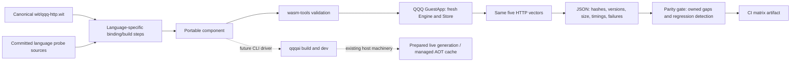

# Phase 3: measured language scaffolding

**Status: experimental probes, 2026-09-30. M5 is not met.** This increment implements
repeatable builds and execution evidence before adding production language drivers.
`qqqai build` still supports Rust only. `qqqai new --lang ts/go/python/cpp` still
reports the existing placeholder status. Do not market these probes as complete
language support, capability parity, or the five reference applications.

## Decisions taken

- **LANG-016 / OQ-002 / POS-006:** call the path **AssemblyScript (TypeScript-like)**.
  Preserve the existing manifest identifier `ts` for compatibility. Never label
  AssemblyScript as full TypeScript. The production CLI driver remains open.
- **LANG-031 / OQ-003:** Python is **experimental**. Its narrow HTTP probe now
  links and executes under the explicit `http.server` grant, but its size and
  startup cost still prevent a first-class performance claim. Revisit after the
  production bindings, correctness suite, and startup work pass; no date or future
  milestone automatically promotes it.
- **LANG-023:** **blocked-by-upstream-and-time**. The TinyGo failure below is now
  root-caused to TinyGo's wasip2 canonical-ABI allocation lifetime: upstream PR
  `tinygo-org/tinygo#4897` retains `cabi_realloc` pointers until the exported call
  returns, but remains an unmerged draft. QQQ carries a request-scoped mitigation;
  no upstream contribution or future review is claimed complete.
- **LANG-024:** **blocked-by-upstream-and-time**. Initial assessment is 2026-09-30;
  quarterly reassessment is due **2026-12-30**. Installing current standard Go is
  not evidence that QQQ's component ABI works on its runtime.

All open rows have the role owner **QQQ language maintainer** in
`conformance/languages/policy.json`; technical gaps are due for review 2026-10-30.
These are review dates, not promises of implementation or assigned individuals.

## The map



The probe runner is `tools/run_language_probes.py`; the real host executor is
`crates/qqq-run/tests/language_probe.rs`. No interpreter is added to the Rust host,
no host capability is widened, and no native artifact deserialization is added.
The existing hot-swap/AOT implementation remains the integration boundary.

## Measurements and what they mean

Measured in GitHub Actions run `36789475802` on Linux x86_64 with Rust 1.98.1 and
`wasm-tools 1.259.0`.
`docs/languages/evidence/` contains the source-hashed execution records. Each
language compiled its real source. Five vectors exercise hello, UTF-8 output,
404, empty POST and a **65,536-byte binary echo**. The last vector matters: a
hello-only test missed the TinyGo defect.

The rows below are the generated Linux CI artifact, not the earlier Windows
rerun. They are narrow HTTP probes: passing five vectors does not claim full
conformance, bindings, CLI, capability parity, or reference-app support.

| Path | Component bytes | Observed result |
|---|---:|---|
| AssemblyScript 0.28.20 | 4,590 | 5/5 vectors passed |
| TinyGo 0.42.0 + Go 1.27.1 | 589,873 (prior precise-GC artifact) | 5/5 with `-gc=leaking`; prior precise-GC 64 KiB failure retained as a negative repro |
| componentize-py 0.25.1 | 18,313,826 | 5/5 vectors passed |
| WASI SDK 34 C | 54,147 | 5/5 vectors passed |
| WASI SDK 34 C++17 using C ABI bindings | 54,147 | 5/5 vectors passed |
| TypeScript 5.9.3 → JS → ComponentizeJS 0.23.0 | 12,035,072 | 5/5 vectors passed |

A prior sample in this session (before the final C optional-body fix) measured uncached engine/preparation at approximately **38.7 ms** for
AssemblyScript, **49.3 ms** for C and **34.7 ms** for C++. First request samples
were approximately **0.49 / 0.44 / 0.38 ms**, respectively. Every call creates a
fresh Store. These debug-host, single-sample probes are **not** production SLOs,
percentiles, comparative throughput benchmarks, or interpreter-pool measurements.

The earlier Linux sample rejected Python after about **6.01 seconds** and TypeScript after about
**8.51 seconds** because the probe supplied `GrantSet::empty()` to an inbound HTTP component. The
corrected probe grants only `http.server`; the corrected Linux artifact measured successful preparation
in about **9.06 seconds** for Python and **10.65 seconds** for TypeScript. These are successful probe
cold preparations, not production cold-start SLOs. Component sizes can change between builds because
these engine-in-Wasm tools snapshot initialization; bit reproducibility is unproven.

### LANG-007: keep the original budget

Three clean guest-target-directory builds through `qqqai build --release`, with
cached dependency downloads and eight build jobs, took **15.68 / 15.02 / 15.01 s**.
Each produced a **167,388-byte** Rust component. The app is **2,726 lines**, not the
required 10,000. Therefore the **≤20 s / 10k LOC budget remains open**. Earlier
25.34-second evidence is retained in the root checklist; this is a different
measurement, not a retroactive correction or a raised limit.

The native GNU release host binary is **26,382,040 bytes** and gzip level 9 is
**8,073,848 bytes**, below the unchanged **60,000,000 / 25,000,000-byte** limits.
Command: `cargo build --release --locked -p qqq-run -j 2`, then byte count and
`gzip.compress(data, compresslevel=9, mtime=0)`. This is not the production image
measurement. Docker is unavailable in this sandbox; its existing gate stays open.

## AssemblyScript: narrow and explicit

AssemblyScript uses a TypeScript-like syntax but a different type system, numeric
model, standard library and runtime. This probe provides no Node/Bun modules,
DOM, arbitrary npm compatibility, dynamic JavaScript objects or general async I/O.
The name is decided; full TypeScript is a separate experimental pipeline.

There is no AssemblyScript generator in the installed `wit-bindgen` CLI. The
probe includes a **narrow canonical HTTP ABI adapter**, with a SHA-256 guard on
the canonical WIT file. It compiles with a stub allocator, renames exactly one
export through `wasm-tools`, embeds the WIT and componentizes the result. A WIT
change fails closed and requires adapter review. This is not LANG-010's general
binding generator. Stub allocations rely on QQQ's fresh Store per call and its
memory/fuel limits; reuse of that instance would need an allocator/reset design.

LANG-009/010/011 are partial scaffolding. LANG-012 remains open for the full
suite, and LANG-013 remains open for the ten-workload reference app.

### Full TypeScript evaluation (LANG-015)

The source is actual TypeScript, erased by `tsc` and embedded with SpiderMonkey.
This exercises a different runtime from AssemblyScript. ComponentizeJS's Weval
AOT option is disabled for this baseline. The resulting 12 MB component imports
the shared `qqq:http/http` type instance even though this handler never calls
outbound HTTP; the probe supplies `http.server` only, so the host binds the
instance without granting outbound permission. The corrected harness executes
all five vectors.

The benchmark therefore rejects first-class compatibility for now. Node/Bun API
compatibility and the full npm ecosystem are not implied by a passing HTTP probe.
Before comparison: add a production driver and full bindings, execute the complete
conformance suite, then measure size, successful cold start and throughput with and
without Weval. Wasmtime native-code caching is a separate layer from Weval.

## Go / TinyGo: root-caused canonical-ABI failure and bounded mitigation

Use `wit-bindgen-go 0.7.0` and `go.bytecodealliance.org/cm 0.3.0`. The general
`wit-bindgen 0.62.0 go` generator is a different path and is not substituted here.
The runner adds the **pinned TinyGo distribution's WASI CLI imports** required by
its runtime, alongside QQQ's unchanged HTTP contract.

TinyGo uses the target's **precise GC and asyncify scheduler** by default. It is
not standard Go's runtime; stdlib, reflection, networking and scheduler behavior
must be verified package by package. Guest GC still exists even though the host
is Rust.

The original 64 KiB vector failed with `404` instead of `200`, while smaller
vectors passed. The failure is now root-caused rather than merely suspected:
TinyGo's host-lowered `cabi_realloc` buffers are held as raw pointers while the
host constructs the exported call. TinyGo's precise and conservative collectors
cannot see those raw pointers as live roots and may reclaim the buffers between
large string/list allocations. The observed symptom is a corrupted URL with the
method still intact. Upstream issue `tinygo-org/tinygo#5742` documents the GC
corruption class, and draft PR `tinygo-org/tinygo#4897` retains the allocations
until `wasmexport` returns. The upstream fix is not in TinyGo `0.42.0` or a
released successor.

QQQ's measured mitigation is `tinygo build -gc=leaking`. `GuestApp::serve_one`
creates a fresh Wasmtime `Store` for each request, so the leaked allocations die
with that request's store and remain bounded by the existing store memory limit.
This is a QQQ lifecycle mitigation, not a general TinyGo recommendation: it must
not be copied to a long-lived reused guest process without an explicit memory
reclamation design. The negative precise/conservative-GC reproduction remains
valuable and must stay in the investigation record.

The generator invocation passes `wit` relative to its working directory. This is
required on native Windows because `wit-bindgen-go 0.7.0` reads through an
embedded WASI preopen and cannot open the absolute Windows path. WSL is not a
runtime or user prerequisite. Native Windows also needs Binaryen `wasm-opt` for
TinyGo's final component lowering; the probe's pinned installer and driver
diagnostics name that dependency explicitly.

Reproduce the passing narrow probe with:
`python tools/run_language_probes.py --language go`. Quarterly standard-Go work
must run the same suite, including the large payload; a compiler version check is
insufficient. Passing these five vectors does not close M5, establish full Go
bindings, or enable the production CLI driver.

## Python: experimental, with the startup work sequenced

The spike generates bindings from the actual HTTP WIT and packages CPython with
`componentize-py`. The generated component imports the shared HTTP type instance;
the probe supplies `http.server` only, so the host binds it without granting
outbound HTTP. The corrected probe executes all five vectors. Its `--stub-wasi`
mode traps WASI operations and snapshots the random seed. **This configuration is
only for the deterministic HTTP probe**, not a production Python template or
secure randomness source. Native extension wheels, networking and stdlib coverage
are unverified.

LANG-025 is a completed spike with a narrow HTTP correctness result. LANG-026/027
have probe scaffolding, not a production SDK/template. LANG-028/029 remain open.
For LANG-030, first establish reset-safe interpreter reuse. Then measure
source versus explicit `.pyc` bundling using the *guest interpreter's* magic/version,
not the host Python version. Verify whether componentize-py's existing snapshot
already pays that cost. Next introduce opt-in interpreter reuse only with reset,
GC, error recovery, isolation and cross-request data-leak tests. QQQ's current pool
limits concurrent requests; it does **not** reuse Python interpreter instances.
No `.pyc` or pooling speedup is claimed or implemented in this increment.

## C and C++

The build uses WASI SDK 34's Clang 23.1.0-wasi-sdk, its `wasm-ld`, sysroot and
component linker, with `--target=wasm32-wasip2 -mexec-model=reactor`. System Clang
alone is insufficient. `wit-bindgen 0.62.0 c` generates headers, glue and the
component-type object from canonical WIT; all three are used. C++17 consumes this
C ABI with the header's C linkage. This is a real C++ compiler invocation, but
not a separate high-level C++ SDK or a C++-specific stdlib/exception test.

Both paths pass the five HTTP probes. LANG-033/034/035 are partial pending
production CLI integration and wider bindings. LANG-036/037 remain open for full
conformance and the ten-workload app. No native shared-library loading is used.

## Run locally and in CI

Required: repository Rust toolchain, `wasm-tools 1.259.0`, Binaryen `wasm-opt` 133,
Node 24.14.1, Go 1.27.1, Python 3.12+, and the compiler versions above. Linux x86_64
archive installation:

```sh
python conformance/languages/install_toolchains.py /absolute/new/tool-prefix
# Add the TinyGo, Binaryen, WASI SDK and wit-bindgen bin directories to PATH (see the CI job).
go install go.bytecodealliance.org/cmd/wit-bindgen-go@v0.7.0
pip install componentize-py==0.25.1
npm ci --ignore-scripts --prefix examples/language-probes
python tools/run_language_probes.py --language assemblyscript
# Repeat for go, python, c, cpp, typescript; retain nonzero exits and JSON reports.
python tools/check_language_parity.py --results target/language-probes \
  --matrix target/language-probes/matrix.md
```

The npm lockfile pins the full tree. A Weval 0.5.0 override removes the vulnerable
archive-extraction dependency from an older transitive copy; the tested tree has
zero npm audit findings. The preview2 shim is explicit because ComponentizeJS's
published embedding imports it. No install scripts are run.

The `language-probes` CI job builds all six paths, executes the real Rust host
test, and uploads the results and generated matrix. The final successful rollout
used GitHub Actions run `36789475802`; its artifact is the source of the tracked
records above. The current Go policy expects the explicit `-gc=leaking`
mitigation to pass all five vectors, while retaining the prior precise-GC result
as a negative regression case. Every result still requires a compiled artifact,
current source hashes, tool versions, owner and review date. Expired review dates
produce reminders without changing pass/fail overnight. A new failure, missing
compiler, stale result, missing report, vacuous test, or an unexpected result
fails the gate for review.

LANG-039/040 remain partial: this generates a measured **HTTP probe matrix** and
checks all 40 obligations; the existing `conformance/suite.json` still owns the
full language × capability matrix. Its four non-Rust rows remain gaps. Declaring
WIT types does not prove the host implements each capability.

## Next implementation increments and acceptance gates

1. **Resolve M5 blockers first.** Keep the TinyGo mitigation bounded to QQQ's
   fresh-store lifecycle and track the upstream fix; build AS bindings from a
   parsed WIT model instead of expanding handwritten ABI layouts. Prove absent
   capabilities stay absent. Preserve negative reproducers.
2. **Production drivers and scaffolds.** Extend `build::toolchain_for`, `plan_pure`,
   `execute` and `new::source_files` together. Represent all build steps in dry-run
   and JSON output; pass argument arrays, preserve errors, atomically stage only
   validated components. Update the existing conformance checker's Rust-only
   guard parser. Keep manifest IDs and Rust behavior compatible.
3. **Complete M5.** AS and Go run the identical full suite and the ten-workload
   reference app; measure budgets without changing them. Every unsupported host
   capability remains owned in the matrix. Hot-replace AS↔Go components through
   the existing live controller, retain old leases, reject a wrong ABI and prove
   AOT-cache execution produces the same output.
4. **Python integration.** Add production bindings and a CLI driver, measure
   successful cold start, then run `.pyc`/pooling experiments with explicit reset
   semantics; retain experimental status until evidence justifies a new decision.
5. **C/C++ integration and parity.** Complete CLI templates, capability bindings,
   tests and reference app. Promote per-capability cells only from real CI calls.

First production-driver PR acceptance: missing tools diagnose clearly; generation
comes from the canonical WIT; dry-run predicts every command; failed builds retain
the prior artifact; Rust CLI/manifest compatibility passes; new-language HTTP and
large-buffer vectors pass; wrong ABI fails before live publication; no new grants,
no budget increase, and no unexecuted language is marked supported.
