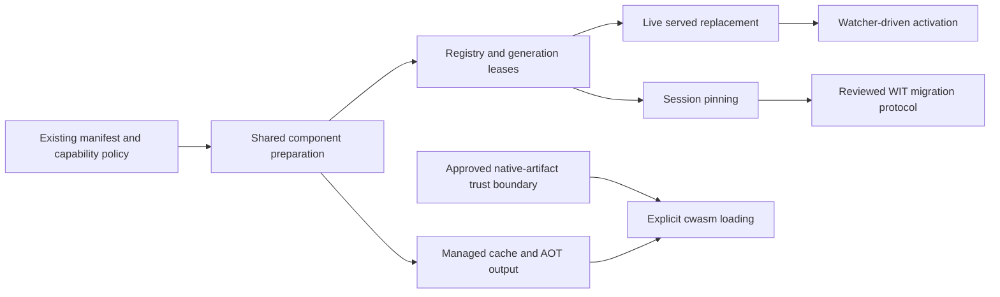

# Live components and AOT delivery checklist

Specification: [RFC](rfc/live-components-and-aot.md). Baseline:
`d12ad758d35e807e28ce178f4bb2df28b946d174`. These work-package labels are local to
this document; they do not create or renumber the root checklist IDs.

An unchecked box means outstanding, including code awaiting execution evidence.
Root items remain open until their whole contract is demonstrated.

## Dependency map

## A. Preparation and AOT — HOST-002, HOST-013, HOST-021, ARCH-015

- [x] One preparation path is called by startup and updates.
- [x] Cache directory is explicit; no ambient configuration is loaded.
- [x] Managed cache is used by the engine, not merely constructed.
- [x] `build --aot` and `--emit-cwasm` produce native bytes and metadata.
- [ ] Output is atomically published; temporary files are cleaned after failures.
- [x] Source digest identifies the actual loaded bytes.
- [x] Compatible cached code survives a process boundary and is actually reused.
- [ ] Source/configuration changes cause misses; authority is checked on hits.
- [ ] Absent/unwritable cache has a documented, tested behavior.
- [x] No cache file is trusted solely because its name contains a digest.
- [ ] Explicit native loading has its own approved safety/trust design.

## B. Registry and lifecycle — DX-006, Proposal §6.6 / §8.1

- [ ] Add, list, acquire, replace and remove have concrete callers and tests.
- [x] A logical name, activation revision and artifact digest are separate values.
- [x] Stable listing order and bounded registry/retirement capacity.
- [x] Preparation occurs outside the publication lock.
- [x] Publication checks a reservation token; stale completion is rejected.
- [x] Remove/re-add does not resurrect a stale token.
- [x] An invocation pins one generation from admission through completion.
- [x] Old code remains alive for existing work and becomes reclaimable afterwards.
- [x] Shared capacity and audit ownership span overlapping generations.
- [x] Candidate exports are validated before publication, including signatures.
- [x] Failed compilation, instantiation and validation preserve active service.

- [ ] Bound aggregate compiled-code bytes and preparation CPU across all live apps.

## C. Reachable development flow — DX-006, DX-008, DX-009

- [x] `qqqai dev` starts the existing HTTP server and keeps it alive across edits.
- [ ] Both flat and body-aware requests observe the same active generation.
- [x] A keep-alive connection sees the new generation on its next invocation.
- [x] Debounce accumulates all changed paths, including manifest changes.
- [x] Build failures do not stop observation or replace the active generation.
- [x] Manifest changes cannot silently change or retain authority under a false report.
- [x] Reload status describes activation success, not only compiler success.
- [ ] Ctrl-C/termination joins owned tasks and stops ticker/watch work.
- [x] Unsupported options are refused rather than reported as performed.

## D. Persistent agents and migration — DX-007, ABI-012

- [ ] Agree and review a runnable agent world separately from descriptor WIT.
- [ ] Session ownership and cancellation are explicit.
- [ ] Checkpoint/restore has schema identity, limits and error contracts.
- [ ] Quiescence prevents writes while taking a checkpoint.
- [ ] Ownership fencing prevents two versions acting as the same session writer.
- [ ] Migration failure resumes the original owner without losing its state.
- [ ] External effects and incompatible schemas have explicit application policies.
- [ ] Capabilities/native resources are recreated, never serialized as raw handles.

## E. Tests that must detect the defect

| Boundary | Positive test | Negative control / fault injection |
|---|---|---|
| Registry publication | A lease sees A; later acquisition sees B | Disable publication; B assertion fails |
| Stale preparation | Newer reserved revision wins | Remove revision check; stale build test fails |
| Drain | Old lease executes after replacement | Drop/redirect old lease; old-result assertion fails |
| Reclamation | Retired weak reference expires | Retain generation; reclamation assertion fails |
| Capacity | Two generations share one ceiling | Allocate separate pools; ceiling assertion fails |
| ABI validation | Compatible component activates | Wrong signature rejected before first live request |
| AOT | Real component executes after cached preparation | Disable cache attachment; reuse assertion fails |
| Artifact output | Native bytes and metadata appear after `--aot` | Skip emission; file/content assertion fails |
| Live HTTP | Same PID/listener answers A then B | Capture the old app permanently; socket test fails |
| Authority | Unchanged policy on replacement | Candidate requesting an ungranted import is refused |

Do not count a compile failure as successful fault injection. Record the failed
assertion, restore the input byte-for-byte, and rerun the test. Do not deserialize
attacker-controlled native bytes merely to see whether an unsafe function returns
an error; test rejection before that boundary.

## F. Merge evidence

- [ ] All changed behavior has been executed with the pinned toolchain.
- [x] `cargo fmt --all -- --check`.
- [x] `cargo clippy --workspace --all-targets --all-features -- -D warnings`.
- [ ] `cargo test --workspace --all-features` and relevant guest tests.
- [ ] Repository Python checks, including self-tests and generated-doc checks.
- [x] Security/dependency gates (`cargo deny check`, `cargo machete`).
- [ ] CodeRabbit review completed; every pass/finding accounted for.
- [ ] CI run belongs to the reviewed commit and required jobs passed.
- [ ] RFC/safety approvals obtained for contract changes requiring them.
- [x] Root checklist states measurements and remaining gaps accurately.

## Evidence and outstanding coverage

Completed boxes refer to this patch's local execution, not to a release or approval.
The handoff records exact commands and limitations. Registry unit tests, real HTTP
components, a persistent TCP connection, a real CLI rebuild and child-process cache
checks provide the evidence. Four injected defects demonstrate the new assertions
are live; existing repository fault injectors also pass and restore their inputs.

The combined cache-configuration/authority criterion remains open: source misses
and `fs.write` rejection are tested, but the full compatibility and import-policy
matrix is not. Atomic file staging is implemented; I/O failure/cleanup injection
remains outstanding. The generic registry's listing API has tests but no package
management command yet. Full body-aware replacement and signal-driven shutdown
need dedicated integration cases beyond the current shared-helper and bounded-exit
coverage. All migration boxes remain open.

## Local-agent review prompt

Read the RFC, this checklist, the root proposal and checklist, and the supplied
agent handbook. Inspect the actual branch diff against its stated baseline.
Trace every new public API to a production caller. Reproduce the tests and inspect
failure controls. Specifically challenge stale activation, remove/re-add races,
overlapping resource limits, audit continuity, cache provenance, cache invalidation,
guest signature checks, termination and manifest-policy changes. Compare the claims
in documentation and PR text with actual outcomes. Preserve unrelated changes.

Do not merge on the strength of a clean unit suite alone. Do not mark an unchecked
phase complete because a neighboring feature works. Fix justified findings, rerun
affected and mandatory gates, and report exact remaining blockers. Merge only after
the maintainer's normal review and approval conditions are met. A draft PR is not a
release and is not authorization to publish a release.
