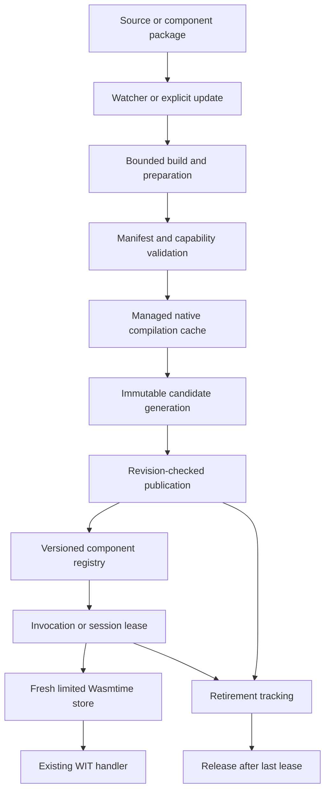

# Live components and AOT preparation

Status: implementation proposal; review required before merge.

Owners: QQQ maintainer and reviewing local agent. Baseline:
`d12ad758d35e807e28ce178f4bb2df28b946d174`.

This RFC advances Proposal §4.6, §6.1, §6.6, §8.1 and §10.5 and checklist
ARCH-015, HOST-002, HOST-013, HOST-021, DX-006, DX-007 and DX-008. It does
not replace the existing proposal, renumber its items, or declare its targets met.
The companion [delivery checklist](../live-components-checklist.md) is the
acceptance ledger for this change. The repository's RFC review period applies to
new guest contracts and changes to the artifact trust boundary.

## Outcome

A developer can rebuild a component while QQQ keeps its listener and host alive.
New requests use the successfully prepared generation. An invocation already
admitted retains its generation until it finishes. Failed builds and failed
preparation leave the last working generation active. AOT preparation moves
compilation out of request dispatch and reuses compatible native code between
processes through Wasmtime's managed cache.

The runtime abstraction is a component. Agents, application handlers and plugins
are uses of components. There is no TUI in this repository. Applications may
observe registry revisions and refresh their own displays. Existing Node/Bun
applications must be adapted to supported WIT interfaces; installing them does
not convert their runtime, dependencies or extension model.

## Verified baseline

* `PreparedComponent::compile` calls `wasmtime::component::Component::new`.
* `GuestApp` instantiates a fresh store for every HTTP request. Dispatch closures
  retain one fixed app. Routing policy already belongs to `qqq-serve`.
* `dev` watches and rebuilds; it does not serve or activate replacements.
* `preload` returns serialized native bytes without storing them. `build --aot`
  accepts the flag and reports `aot_performed: false`.
* Wasmtime cache configuration and explicit component deserialization are not wired.
* `qqq:agent/descriptor` is authored WIT, not a runnable agent/session manager.
* Stores have epoch deadlines, but the production host lacks an epoch ticker.
* The build driver supports Rust. Other languages remain separate roadmap work.

These statements describe the baseline, not the status of the implementation
beside this RFC. Validation results belong in the delivery checklist and PR.

## Architecture map

| Owner | Responsibility | Must not own |
|---|---|---|
| `qqq-host` | engine, compiled component, store limits, guest invocation | CLI paths, package download, UI |
| `qqq-run` | explicit cache location, build, preparation, registry, dev orchestration | a second capability policy |
| `qqq-serve` | listener, routing, authentication, request bodies, transport draining | compilation or guest package selection |
| `qqq-pkg` | artifact integrity, signatures and content-addressed storage | engine-specific execution |
| `qqq-abi` / `wit` | published guest contracts | application session state |

Use one compatible engine for concurrent generations. Engine configuration is
immutable; sharing it must not share mutable guest stores. Keep registry identity,
artifact digest, package version, interface version and state schema separate.

## Publication protocol

1. Reserve an update revision before expensive preparation.
2. Read one complete artifact into owned bytes and compute its digest.
3. Validate the manifest and artifact against the unchanged effective policy.
4. Compile or load through the managed cache, instantiate with limits, and validate
   the full handler signature. Preparation must not call a business handler.
5. Acquire the publication lock and compare the expected revision. A stale build
   cannot supersede a newer request to update or remove the component.
6. Publish the complete generation atomically. Release the lock before execution.
7. Retain retired generations only for leases already admitted. Bound simultaneous
   retired generations; refuse further updates when the retention limit is reached.

Acquiring a generation lease is the admission boundary. A lease obtained before
publication may begin executing afterwards; it still belongs to the old generation.
Never reload the slot halfway through an invocation. Removal stops new admissions
and permits outstanding leases to finish. Re-adding a name must not make an old
preparation token valid again (the ABA problem).

A short-held `Mutex` is sufficient. `ArcSwap` is a later measured optimization,
not a correctness requirement. Listing uses stable ordering. Revisions allow
observers to resynchronize after a missed event; audit events must not depend on
a lossy UI notification channel.

## Concurrency and resources

Compilation and language builds run away from the socket executor. Guest calls
remain bounded by fuel and an independently driven epoch clock. A registry lock must never
span guest code, compilation, network I/O, audit persistence or waiting for drain.
The update path has a separate nonblocking preparation guard; concurrent updates
are refused for retry while a candidate is being prepared.
The same logical component shares invocation capacity and audit ownership across
generations. A replacement must not double `--workers` capacity or fork the audit
chain. Candidate preparation is limited to one candidate per live app. Compiled-code
memory is not yet governed by a process-wide byte budget; the checklist keeps
that remaining resource limit explicit.

References preserve lifetime; they do not guarantee termination. Long-lived
streams/sessions need a deadline and cancellation policy. An epoch ticker provides
preemption for Wasm execution, but host I/O requires its own timeouts. Do not claim
that aborting a Tokio task cancels a synchronous host operation.

## State and session map

Stateless HTTP replacement is tier 1 and matches the current request isolation
model. A session can pin its generation explicitly; that is continuity without
migration. The runtime must never infer that copying linear memory is safe.

Tier 2 requires the following guest protocol, subject to a separate WIT review:

* `checkpoint`: bounded bytes plus schema identity and logical checkpoint number.
* `restore`: accept an explicitly supported schema and report rejection without
  publishing the candidate.
* Quiescence: stop admission and wait for writers before checkpointing.
* Ownership: fence the old writer before activating the restored writer.
* Failure: resume the original owner if preparation fails before commit.
* External effects: application idempotency/transactions are required; a registry
  rollback does not reverse an HTTP request, database write or emitted message.

Native resources, network connections and capability handles cannot be serialized
into guest state. Recreate them under current grants. Checkpoint confidentiality,
maximum size, supported schema transitions and timeout behavior must be tested.
Persistent agent execution is a separate WIT contract from HTTP request dispatch.

## Authority changes

Code-only replacement preserves the effective manifest. Manifest changes must be
detected before publication. Until a reviewed tier-3 coordinator exists, report
that a restart is required and retain the last working configuration; do not
announce a restart that never happened. A removed grant must not silently remain
authorized for newly admitted work under a purportedly updated manifest.

Dynamic installation is a privileged host operation, not a capability every guest
receives. Package verification, policy approval and activation are distinct steps.
The registry does not itself grant filesystem, network or installation authority.

## AOT map

Portable `.component.wasm` remains the source of truth. Wasmtime's managed cache
is enabled only with an explicit directory selected by orchestration. That
directory is host-owned native-code storage and must not be writable by guests
or untrusted package authors. Do not read ambient user Wasmtime configuration.

`build --aot` prepares native code and emits `.cwasm`
plus metadata using atomic file replacement. The report becomes true only after
successful output. Adding `--aot-cache` also warms the managed cache. An emitted artifact is a cache product, not portable Wasm and
not a replacement for the original component.

Startup and reload use the same configuration and cache. Cache identity includes
source digest, exact Wasmtime version, target/CPU compatibility and compiler
settings. A source package signature does not authenticate unrelated native bytes.
Capability checks and linker construction still occur on cache hits.

Explicit loading of arbitrary `.cwasm` needs a separate trusted-artifact wrapper:
Wasmtime's deserialization API is unsafe. This RFC does not approve weakening
`#![forbid(unsafe_code)]`. The existing exception process requires a safety
argument and independent approval. Until that boundary is accepted, use the safe
managed cache and reject standalone native input through the component loader.

## Performance claims

Measure source compilation, cache lookup/load, instantiation, first response,
activation, drain, peak RSS and latency under concurrent requests separately.
Publish hardware, engine/compiler versions, component identity, sample counts and
percentiles. A nanosecond pointer operation does not imply an equally fast update.
Background work still competes for CPU and memory. No target is marked met by this
RFC. Bun already supports process-preserving hot reload; QQQ's contribution is its
component, capability and lifecycle contract.

## Rollout and rollback

Land executable slices: managed cache and AOT output; registry/leases; served
replacement; dev wiring; session protocols. Existing CLI output fields retain
their meanings. Failed preparation is observable and does not replace the active
app. For the first rollout, deployment rollback selects a previously verified
artifact as a new generation. Keep the old portable artifact until rollback policy
permits deletion. Repeated updates and removal must not retain generations forever.

## Source integration map

| File | Integration in this patch | Boundary preserved |
|---|---|---|
| `qqq-run/src/generations.rs` | Generic registry, reservations, immutable generation leases | Guest-independent orchestration |
| `qqq-run/src/live.rs` | Typed preparation and live HTTP dispatch | Existing HTTP WIT |
| `qqq-run/src/guest_handler.rs` | Shared pool/audit/epoch ownership and full signature check | Fresh store per request; original grants |
| `qqq-host/src/instance.rs` | Explicit epoch ticks when a production clock is present | Legacy deadline default for other callers |
| `qqq-host/src/abi.rs` | Correct Rust HTTP error binding to WIT variant | Existing published WIT stays unchanged |
| `qqq-run/src/serve.rs` | Host controller plus per-invocation resolution | Existing listener, routing and authentication |
| `qqq-serve/src/server.rs` | Offload synchronous guest calls; track and drain connections | Existing HTTP/WS transport contracts |
| `qqq-run/src/dev.rs` | Rebuild, validate, activate and preserve manifest barrier | Existing watcher and manifest policy |
| `qqq-run/src/aot.rs` | Explicit managed cache, native emission and provenance | Portable source; no unsafe native loader |
| `qqq-run/src/build.rs`, `run.rs`, `main.rs` | Wire build/run/serve flags to actual behavior | Existing CLI fields and flag aliases |
| `qqq-run/tests/live_components.rs` | Real ABI, sockets, overlap and cross-process cache evidence | Executable assertions |
| `tools/check_live_dev.py`, `tools/fault_inject_live_components.py` | CLI end-to-end and four intentional defects | Evidence that integration is reached |

Paths in this table are relative to `crates/` unless they start with `tools/`.
The bundled RFC and checklist are additional documents; the root proposal remains
the governing specification. The attached handbook was reconciled against current
source rather than treated as proof that its historical status is current.

## Smallest useful first PR and review split

If the maintainer prefers incremental PRs, extract **registry + validated live HTTP
controller + served-dispatch integration** first. Include the epoch driver, shared
quota/audit ownership and HTTP binding correction that make that path safe and
executable. Its real caller is `serve::Prepared.live`, exercised through the same
listener by an embedding host. Acceptance requires old/new results, stale-token
rejection, bad-candidate retention, shared quota, removal refusal and reclamation.
A registry without a running caller is insufficient.

Then review watcher/CLI activation, and finally managed AOT cache/emission as
separate follow-ups. This delivery includes all three connected foundation slices
for local review, with tests. It does not implement the persistent-agent protocol
or package installer described in later phases. Agree those contracts before
writing their guest-facing code; otherwise multiple agents would invent competing
interfaces while the main roadmap is still open.

## Review decision

The local reviewing agent must distinguish implemented behavior, tests actually
executed, proposed contracts and approvals outstanding. In particular, do not
approve tier 2, explicit native-artifact loading or a performance SLO on the
strength of tier-1 or managed-cache tests. See the delivery checklist for executable
acceptance and the precise merge checklist.
